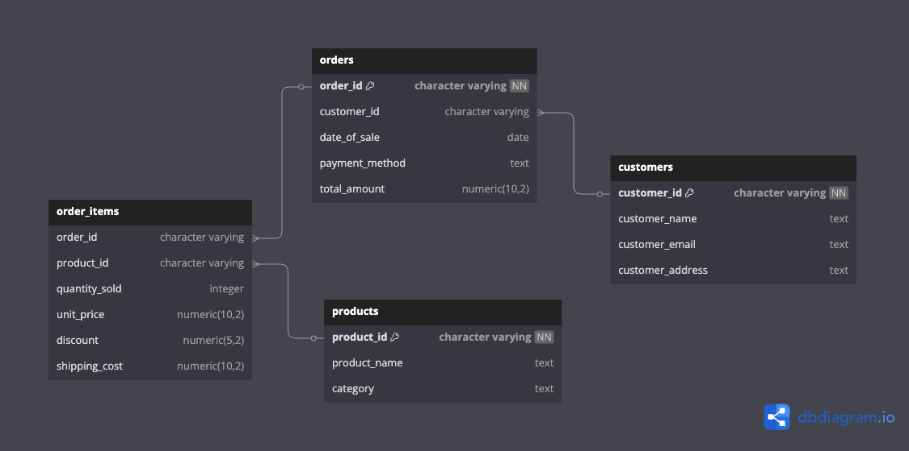

# API-CSV Project

## Overview

This project is an API server designed to handle CSV data processing and analysis. It demonstrates backend development principles, data modeling, API design, and data analysis while focusing on performance optimization for large datasets.

---

## Deliverables

1. **URL for the final code**: [GitHub Repository](https://github.com/saravana512/API-CSV-Parse-Lumal)
2. **Database Schema Diagram**: [Schema Diagram](ERD.png)
3. **Execution Instructions**: Detailed below.
4. **API Documentation**: See the table below.

---

## Prerequisites

Before running the project, ensure you have the following installed:

- **Node.js**: Version 18.x or higher
- **Database**: PostgreSQL
- **Other Tools**: `npm` (Node Package Manager)

---

## Setup Instructions

1. Clone the repository:

    ```bash
    git clone https://github.com/saravana512/API-CSV-Parse-Lumal.git
    cd API-CSV-Parse-Lumal
    ```

2. Install dependencies:

    ```sh
    npm install
    ```

3. Post Install (Auto Execution - Database Migration):

    ```sh
    npm run migrate
    ```

4. Set up environment variables:
   Create a `.env` file in the root directory and add the required environment variables as mentioned in the "Database Configuration" section.

5. Start the application:
    ```sh
    npm start
    ```

## Usage

Once the application is running, you can access it at `http://localhost:9002`. Use the provided API endpoints to shorten URLs and manage them.

## Database Configuration (PostgreSQL)

This project uses PostgreSQL as the database. Below are the required environment variables:

```env
DATABASE_HOST=<your-database-host>
DATABASE_USER=<your-database-user>
DATABASE_PASSWORD='<your-database-password>'
DATABASE_PORT=20866 # PostgreSQL default port
DATABASE_NAME=lumel
DATABASE_SSH=1
```

## Features

- **Express**: Web framework for Node.js.
- **Rate Limiter**: Middleware to limit repeated requests to public APIs and/or endpoints.
- **Nodemon**: Automatically restarts the server for development.
- **Winston**: Logging library for structured application logs.
- **UUID**: Generates unique request IDs for tracking.
- **Compression**: Uses Gzip compression for improved performance.
- **Helmet**: Security middleware for setting HTTP headers.
- **CORS**: Middleware to enable Cross-Origin Resource Sharing.
- **Body-Parser**: Middleware to parse incoming request bodies.
- **Error Handling**: Standardized error responses for better debugging and consistency.
- **HPP (HTTP Parameter Pollution Prevention)**: Protects against HTTP parameter pollution attacks.
- **Request Logging**: Logs request body, params, query, and headers for debugging and auditing.
- **Prettier**: Code formatter for maintaining a consistent code style.
- **.gitignore**: Pre-configured to exclude sensitive files and directories.

## Swagger API Documentation

The application includes Swagger for API documentation. You can access the Swagger UI at the `http://localhost:9002/api-docs/` endpoint to explore and test the API endpoints interactively.

## API Documentation

| Route                                                             | Method | Body (JSON)              | Sample Response (JSON)                              | Description                                                         |
| ----------------------------------------------------------------- | ------ | ------------------------ | --------------------------------------------------- | ------------------------------------------------------------------- |
| `/api/products/import`                                            | POST   | `{ "file": "file.csv" }` | `{ "message": "File imported successfully" }`       | Uploads a CSV file containing product data for processing.          |
| `/api/products/analytics/revenuecalculation/:startDate/:endDate`  | GET    | N/A                      | `{ "totalRevenue": 10000 }`                         | Calculates total revenue between the specified start and end dates. |
| `/api/products/analytics/top-products/:limit/:startDate/:endDate` | GET    | N/A                      | `[ { "product": "Product A", "sales": 500 } ]`      | Retrieves the top-selling products within the specified date range. |
| `/api/products/analytics/customers/:startDate/:endDate`           | GET    | N/A                      | `[ { "customer": "Customer A", "purchases": 10 } ]` | Fetches customer analytics for the specified date range.            |
| `/api/products/analytics/metrics/:startDate/:endDate`             | GET    | N/A                      | `{ "totalOrders": 100, "averageOrderValue": 50 }`   | Provides key metrics such as total orders and average order value.  |

---

## Design Decisions

1. **Backend Framework**: Node.js with Express.js for its simplicity and scalability.
2. **Database**: PostgreSQL for its robust support for relational data and performance.
3. **CSV Parsing**: Used `multer` for file uploads and `csv-parser` for efficient CSV file handling.
4. **Performance Optimization**: Implemented streaming for large file uploads and database indexing for faster queries.
5. **Modular Design**: Routes, controllers, and services are separated for better maintainability and scalability.
6. **Cron Jobs**: Used the `cron` library to schedule and automate periodic tasks, such as cleaning up old data or generating reports.

---

## Database Schema


